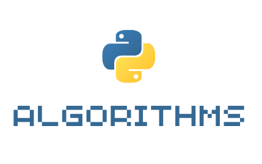

<h1 align="center">Py Algorithms</h1>

<p align="center">
    
</p>

<p align="center">Alguns algoritmos desenvolvidos com python.</p>

## :bulb: Ideia principal

Alguns algoritmos famosos(ou não), desenvolvidos com python. Este repositório tem o objetivo de guardar códigos de diferentes algoritmos, para que possam ser implementados/estudados no futuro.

## :wrench: Testes

No diretório *test*, estão contidos os arquivos para testar cada algoritmo.
É utilizado o **framework unittest** para realizar os testes.
Na linha de comando, você pode executar o comando a seguir para executá-los:

```bash
python -m unittest discover test
```

## :heart: Contribuições

Você pode contribuir para o projeto, basta abrir um *pull request*.
